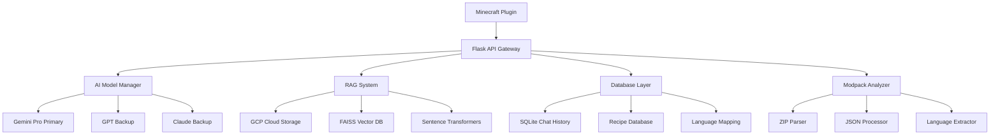

# 🎮 마인크래프트 모드팩 AI 전문가 시스템 요구사항 명세서

**프로젝트명**: Minecraft Modpack AI Expert System  
**버전**: 1.0  
**작성일**: 2024년 1월  
**문서 유형**: 기능 요구사항 명세서 (Functional Requirements Specification)

---

## 📋 문서 개요

### 1.1 문서 목적
본 문서는 마인크래프트 모드팩 서버를 위한 AI 전문가 시스템의 기능적/비기능적 요구사항을 상세히 정의한다. 개발팀이 시스템을 구현하기 위한 완전한 기술 명세서 역할을 한다.

### 1.2 문서 범위
- 마인크래프트 플러그인 개발
- Python Flask 기반 AI 백엔드 시스템
- Google Cloud Platform 통합
- 다중 AI 모델 지원 시스템
- 실시간 모드팩 분석 및 관리

### 1.3 용어 정의
| 용어 | 정의 |
|------|------|
| 모드팩 (Modpack) | 여러 마인크래프트 모드를 묶어 배포하는 패키지 |
| RAG | Retrieval Augmented Generation, 벡터 검색 기반 정보 증강 |
| GUI | 게임 내 그래픽 사용자 인터페이스 |
| 3x3 제작법 | 마인크래프트의 기본 제작 테이블 크기 |
| 하이브리드 매핑 | 다단계 한글-영어 변환 시스템 |

---

## 🎯 프로젝트 개요

### 2.1 프로젝트 배경
- **대상 사용자**: 대학생 마인크래프트 모드팩 서버 운영자 및 플레이어 (5-8명)
- **핵심 문제**: 영어 모드팩의 복잡성으로 인한 진입 장벽
- **해결 목표**: 한글 기반 AI 어시스턴트를 통한 모드팩 학습 곡선 완화

### 2.2 비즈니스 목표
- **사용성 향상**: 모드팩 관련 정보 접근성 90% 개선
- **학습 효율성**: 신규 플레이어 적응 시간 70% 단축
- **비용 효율성**: 월 운영 비용 $20 이하 유지
- **확장성**: 다양한 모드팩으로의 빠른 전환 지원

---

## 🏗️ 시스템 아키텍처 요구사항

### 3.1 전체 시스템 구조



### 3.2 기술 스택 요구사항

#### 3.2.1 프론트엔드 (Minecraft Plugin)
- **언어**: Java 17+
- **플랫폼**: Spigot/Paper 1.20.1+
- **의존성**: 
  - Bukkit API
  - HTTP Client (OkHttp 권장)
  - JSON 처리 (Gson)

#### 3.2.2 백엔드 (AI Processing)
- **언어**: Python 3.9+
- **프레임워크**: Flask 2.3+
- **핵심 라이브러리**:
  - `openai>=1.0.0`
  - `anthropic>=0.8.0`
  - `google-generativeai>=0.3.0`
  - `sentence-transformers>=2.2.0`
  - `faiss-cpu>=1.7.0`
  - `google-cloud-storage>=2.0.0`

#### 3.2.3 인프라
- **클라우드**: Google Cloud Platform
- **컴퓨팅**: GCP VM (Debian 11)
- **스토리지**: Google Cloud Storage
- **데이터베이스**: SQLite (로컬), FAISS (벡터)
- **프로세스 관리**: systemd

---

## 🔧 기능적 요구사항

### 4.1 마인크래프트 플러그인 요구사항

#### 4.1.1 아이템 기반 인터랙션 [REQ-001]
**요구사항**: 특정 아이템을 통한 AI 인터페이스 접근
```yaml
기능_ID: REQ-001
우선순위: Critical
설명: 플레이어가 AI 아이템을 우클릭하면 GUI가 열림
전제조건: 
  - 플레이어가 AI 아이템을 소지
  - 서버에 백엔드 API 연결 상태
입력: 
  - 마우스 우클릭 이벤트
  - 플레이어 UUID
출력: 
  - GUI 창 표시
  - API 연결 상태 확인
예외처리: 
  - API 서버 다운 시 오프라인 메시지 표시
  - 권한 없는 플레이어 접근 거부
테스트_케이스:
  - 정상 사용자 GUI 열기
  - API 서버 다운 상황
  - 동시 접속자 10명 테스트
```

#### 4.1.2 GUI 시스템 [REQ-002]
**요구사항**: 54슬롯 인벤토리 기반 대화형 인터페이스
```yaml
기능_ID: REQ-002
우선순위: Critical
설명: 게임 내 AI 상호작용을 위한 GUI 시스템
레이아웃:
  슬롯_1-9: 모드팩 정보 표시 영역
  슬롯_10-18: 3x3 제작법 표시 영역 (슬롯 10,11,12,19,20,21,28,29,30)
  슬롯_19-45: 채팅 기록 스크롤 영역
  슬롯_46-54: 컨트롤 버튼 (전송, 지우기, 모델 선택 등)
동적_요소:
  - 실시간 채팅 메시지 업데이트
  - 제작법 아이템 시각적 배치
  - 모델 선택 드롭다운
상호작용:
  - 텍스트 입력 (Anvil GUI 연동)
  - 버튼 클릭 이벤트 처리
  - 스크롤 기능 (이전/다음 페이지)
```

#### 4.1.3 명령어 시스템 [REQ-003]
**요구사항**: 콘솔 및 채팅 기반 명령어 지원
```yaml
기능_ID: REQ-003
우선순위: High
명령어_목록:
  /ai <질문>:
    권한: modpackai.use
    설명: 즉시 AI에게 질문
    예시: "/ai 철 블록은 어떻게 만들어?"
  /modpackai chat:
    권한: modpackai.use
    설명: AI GUI 열기
  /modpackai recipe <아이템명>:
    권한: modpackai.use
    설명: 특정 아이템 제작법 조회
  /modpackai models:
    권한: modpackai.use
    설명: 사용 가능한 AI 모델 목록
  /modpackai switch <모델ID>:
    권한: modpackai.admin
    설명: AI 모델 전환
  /modpackai reload:
    권한: modpackai.admin
    설명: 플러그인 설정 리로드
오류_처리:
  - 권한 없음: "권한이 없습니다" 메시지
  - 잘못된 명령어: 사용법 안내
  - API 오류: 상세 오류 메시지 제공
```

### 4.2 AI 백엔드 시스템 요구사항

#### 4.2.1 다중 AI 모델 관리 [REQ-004]
**요구사항**: 우선순위 기반 AI 모델 선택 및 관리
```yaml
기능_ID: REQ-004
우선순위: Critical
모델_우선순위:
  1. Gemini Pro (메인):
     - 웹검색 항상 활성화
     - GCP 크레딧 사용
     - 무료 티어 우선 활용
  2. GPT-3.5 Turbo (백업):
     - 웹검색 비활성화
     - 무료 티어만 사용
  3. Claude 3 Haiku (백업):
     - 웹검색 비활성화
     - 무료 티어만 사용
  4. 유료 모델 (선택):
     - GPT-4, Claude Sonnet
     - 기본 비활성화
     - 수동 활성화 가능
동적_전환:
  - 크레딧 소진 시 자동 백업 모델 전환
  - 실패 시 다음 우선순위 모델 시도
  - 최대 3회 재시도 후 오류 반환
모니터링:
  - 모델별 사용량 추적
  - 응답 시간 측정
  - 오류율 모니터링
```

#### 4.2.2 질문 처리 플로우 [REQ-005]
**요구사항**: 사용자 정의 질문 처리 파이프라인
```yaml
기능_ID: REQ-005
우선순위: Critical
처리_단계:
  1. 입력_검증:
     - UUID 형식 검사 (RFC 4122)
     - 메시지 길이 제한 (1000자)
     - XSS/SQLi 필터링
  2. 언어_처리:
     - 한글 아이템명 추출 (정규식: [가-힣]+)
     - 하이브리드 매핑 실행 (4단계)
     - 변환된 영어명으로 메시지 업데이트
  3. 컨텍스트_수집 (병렬):
     - 로컬 DB 검색 (<100ms)
     - RAG 벡터 검색 (<500ms)
     - 웹검색 (Gemini Pro만, <3초)
  4. 프롬프트_구성:
     - 시스템 프롬프트 + 컨텍스트 + 질문
     - 토큰 수 최적화 (8K 토큰 이내)
  5. AI_호출:
     - 선택된 모델로 API 호출
     - 타임아웃: 30초
     - 재시도: 최대 3회
  6. 후처리:
     - 한글(영어) 형식 변환
     - 특수문자 정리
     - 응답 길이 제한
성능_요구사항:
  - 전체 응답 시간: <6초 (95%ile)
  - 동시 처리: 10개 요청
  - 메모리 사용량: <2GB
```

#### 4.2.3 RAG 시스템 [REQ-006]
**요구사항**: 필수 벡터 검색 시스템
```yaml
기능_ID: REQ-006
우선순위: Critical
아키텍처:
  - 임베딩 모델: sentence-transformers/all-MiniLM-L6-v2
  - 벡터 DB: FAISS (IndexFlatIP)
  - 스토리지: Google Cloud Storage
  - 차원: 384차원 벡터
초기화_요구사항:
  - GCP_PROJECT_ID 환경변수 필수
  - GCS_BUCKET_NAME 환경변수 필수
  - 누락 시 서비스 시작 실패 (ValueError)
데이터_처리:
  - 모드팩 ZIP 파일 자동 분석
  - JSON 레시피 파싱
  - 언어 파일 추출
  - 청크 단위 벡터화 (512토큰)
검색_기능:
  - 유사도 기반 검색 (코사인 유사도)
  - Top-K 결과 반환 (기본 3개)
  - 임계값 필터링 (0.7 이상)
  - 모드팩별 필터링
오류_처리:
  - RAG 실패 시 RuntimeError 발생
  - 서비스 degraded 방지
  - 명시적 실패 알림
```

#### 4.2.4 언어 매핑 시스템 [REQ-007]
**요구사항**: 4단계 하이브리드 한글-영어 변환
```yaml
기능_ID: REQ-007
우선순위: High
매핑_단계:
  1단계_사용자정의:
    - 개인별 커스텀 매핑
    - 신뢰도: 1.0
    - 우선순위: 최고
  2단계_일반DB:
    - 공통 매핑 데이터베이스
    - 사용량 기반 신뢰도
    - 신뢰도: 0.8-0.95
  3단계_부분일치:
    - 문자열 유사도 검색
    - Levenshtein 거리 기반
    - 신뢰도: 0.6-0.8
  4단계_AI번역:
    - 현재 선택된 AI 모델 활용
    - 컨텍스트 기반 번역
    - 신뢰도: 0.5-0.8
실패_처리:
  - 신뢰도 0.5 미만: 사용자에게 재요청
  - 메시지: "[아이템명]의 영어 이름을 입력해주세요"
  - 학습 기능: 사용자 입력을 1단계에 저장
응답_형식:
  - 성공: "한글(English)" 형태
  - 예시: "철괴(Iron Ingot)", "다이아몬드(Diamond)"
성능_요구사항:
  - 매핑 응답 시간: <200ms
  - 캐시 적중률: >80%
  - DB 크기: <100MB
```

### 4.3 모드팩 관리 시스템 요구사항

#### 4.3.1 모드팩 분석기 [REQ-008]
**요구사항**: 자동화된 모드팩 정보 추출 시스템
```yaml
기능_ID: REQ-008
우선순위: High
지원_형식:
  - ZIP 파일 (모드팩 배포 형태)
  - JAR 파일 (개별 모드)
  - JSON 파일 (레시피 정의)
추출_데이터:
  모드_정보:
    - 모드 이름 및 버전
    - 파일명에서 정규식 추출
    - mod.toml/mcmod.info 파싱
  레시피_정보:
    - data/*/recipes/*.json 파싱
    - 3x3 제작법만 지원
    - 결과물 및 재료 추출
  아이템_정보:
    - assets/*/lang/*.json 파싱
    - 한글/영어 매핑 생성
    - 아이템 설명 추출
  메타데이터:
    - pack.mcmeta 정보
    - 모드팩 버전 추출
    - 호환성 정보
처리_성능:
  - 파일 크기: 최대 2GB
  - 처리 시간: <5분 (100MB당)
  - 메모리 사용: <1GB
오류_처리:
  - 손상된 ZIP: 부분 복구 시도
  - 잘못된 JSON: 스킵 후 계속
  - 권한 오류: 명확한 에러 메시지
```

#### 4.3.2 CLI 모드팩 전환 [REQ-009]
**요구사항**: 명령줄 기반 모드팩 변경 시스템
```yaml
기능_ID: REQ-009
우선순위: High
스크립트_명: modpack_switch.sh
사용법: ./modpack_switch.sh
동작_과정:
  1. 환경설정_읽기:
     - .env 파일에서 CURRENT_MODPACK_NAME 읽기
     - CURRENT_MODPACK_VERSION 읽기
  2. 파일_검증:
     - modpacks/ 디렉토리에서 ZIP 파일 확인
     - 파일명에서 버전 자동 추출
     - 정규식: ([a-zA-Z0-9_-]+)-?v?(\d+\.\d+\.\d+)\.zip
  3. 분석_실행:
     - 지정된 모드팩만 분석
     - 기존 데이터 백업
     - 새 데이터로 교체
  4. 설정_업데이트:
     - .env 파일의 현재 모드팩 정보 업데이트
     - 백엔드 서비스 재시작
로깅:
  - 상세 진행 상황 출력
  - 오류 시 rollback 수행
  - 완료 시 검증 결과 표시
예외_처리:
  - 파일 없음: 명확한 오류 메시지
  - 권한 부족: sudo 요구 안내
  - 디스크 부족: 용량 확인 안내
```

---

## 🔒 비기능적 요구사항

### 5.1 성능 요구사항

#### 5.1.1 응답 시간 [NFR-001]
```yaml
요구사항_ID: NFR-001
분류: 성능
메트릭:
  - 로컬 DB 검색: <100ms (95%ile)
  - RAG 벡터 검색: <500ms (95%ile)
  - AI 모델 응답: <5초 (95%ile)
  - 전체 응답: <6초 (95%ile)
  - GUI 응답: <200ms (99%ile)
측정_방법:
  - APM 도구 통합
  - 로그 기반 메트릭
  - 사용자 체감 설문
```

#### 5.1.2 동시성 [NFR-002]
```yaml
요구사항_ID: NFR-002
분류: 성능
목표:
  - 동시 사용자: 10명
  - 동시 API 요청: 5개
  - 메모리 사용량: <2GB
  - CPU 사용률: <80%
스트레스_테스트:
  - 15분간 지속 부하
  - 점진적 사용자 증가
  - 메모리 누수 검사
```

### 5.2 보안 요구사항

#### 5.2.1 입력 검증 [NFR-003]
```yaml
요구사항_ID: NFR-003
분류: 보안
검증_항목:
  UUID_형식:
    - 정규식: ^[0-9a-f]{8}-[0-9a-f]{4}-[0-9a-f]{4}-[0-9a-f]{4}-[0-9a-f]{12}$
    - 실패 시: HTTP 400 반환
  메시지_길이:
    - 최대: 1000자
    - 실패 시: "메시지가 너무 깁니다" 오류
  XSS_방지:
    - HTML 태그 제거
    - JavaScript 코드 필터링
    - 안전한 문자만 허용
  SQLi_방지:
    - 파라미터화된 쿼리 사용
    - 특수문자 이스케이프
    - ORM 레벨 보호
```

#### 5.2.2 API 보안 [NFR-004]
```yaml
요구사항_ID: NFR-004
분류: 보안
Rate_Limiting:
  - 사용자당: 10요청/분
  - IP당: 50요청/분
  - 초과 시: HTTP 429 반환
CORS_설정:
  - 허용 Origin: 마인크래프트 서버만
  - 허용 Method: GET, POST
  - 허용 Header: Content-Type, Authorization
API_키_관리:
  - 환경변수 저장
  - 로그에서 제외
  - 정기적 순환 권장
```

### 5.3 가용성 요구사항

#### 5.3.1 서비스 안정성 [NFR-005]
```yaml
요구사항_ID: NFR-005
분류: 가용성
목표_지표:
  - Uptime: 99.5% (월간)
  - MTTR: <30분
  - MTBF: >720시간
장애_대응:
  자동_복구:
    - API 서버 재시작
    - 데이터베이스 연결 복구
    - 임시 파일 정리
  모니터링:
    - 헬스체크 엔드포인트
    - 리소스 사용량 추적
    - 오류율 알림
백업_전략:
  - 데이터베이스: 일 1회
  - 설정 파일: 변경 시마다
  - 모드팩 데이터: 주 1회
```

### 5.4 확장성 요구사항

#### 5.4.1 수평적 확장 [NFR-006]
```yaml
요구사항_ID: NFR-006
분류: 확장성
아키텍처_고려사항:
  - 상태비저장 API 설계
  - 세션 정보 외부 저장
  - 로드 밸런서 지원
확장_포인트:
  - 사용자 50명까지 확장 고려
  - 멀티 서버 배포 가능
  - 데이터베이스 샤딩 준비
모니터링_지표:
  - CPU 사용률 임계치: 70%
  - 메모리 사용률 임계치: 80%
  - 응답 시간 임계치: 10초
```

---

## 💰 비용 요구사항

### 6.1 예산 제약 [REQ-010]
```yaml
요구사항_ID: REQ-010
우선순위: Critical
월간_예산: $20 이하
비용_구조:
  Gemini_Pro:
    - GCP 무료 크레딧 활용
    - 예상 사용량: $2-5/월
    - 우선 활용 대상
  백업_모델:
    - GPT-3.5: 무료 티어
    - Claude Haiku: 무료 티어
    - 총 $0-3/월
  인프라:
    - GCP VM: $8-12/월
    - Cloud Storage: $1-2/월
최적화_전략:
  - 토큰 사용량 모니터링
  - 캐싱을 통한 API 호출 최소화
  - 무료 크레딧 우선 소진
비용_알림:
  - 80% 사용 시 경고
  - 95% 사용 시 서비스 제한
  - 초과 시 백업 모델 전환
```

---

## 🧪 테스트 요구사항

### 7.1 단위 테스트 [TEST-001]
```yaml
테스트_ID: TEST-001
범위: 모든 백엔드 모듈
커버리지: >90%
테스트_프레임워크: pytest
필수_테스트_케이스:
  AI_모델_관리:
    - 모델 전환 테스트
    - 오류 처리 테스트
    - 재시도 로직 테스트
  RAG_시스템:
    - 벡터 검색 정확도
    - 임베딩 생성 테스트
    - GCS 연동 테스트
  언어_매핑:
    - 4단계 매핑 테스트
    - 신뢰도 계산 테스트
    - 캐시 동작 테스트
모킹_전략:
  - 외부 API 호출 모킹
  - 데이터베이스 격리
  - 파일 시스템 모킹
```

### 7.2 통합 테스트 [TEST-002]
```yaml
테스트_ID: TEST-002
범위: 전체 시스템 워크플로우
시나리오:
  기본_질문_응답:
    1. 플레이어가 "/ai 철괴 제작법" 입력
    2. 한글-영어 변환 수행
    3. RAG + 웹검색 실행
    4. Gemini Pro 응답 생성
    5. 한글(영어) 형식으로 반환
  모드팩_전환:
    1. 새 모드팩 ZIP 업로드
    2. CLI 스크립트 실행
    3. 분석 및 데이터 업데이트
    4. 서비스 재시작
    5. 새 모드팩 질문 테스트
  오류_시나리오:
    1. API 키 누락
    2. 네트워크 오류
    3. 메모리 부족
    4. 동시 접속 한계 초과
성능_검증:
  - 응답 시간 SLA 준수
  - 메모리 누수 없음
  - 동시성 테스트 통과
```

### 7.3 사용자 받아들임 테스트 [TEST-003]
```yaml
테스트_ID: TEST-003
참여자: 실제 마인크래프트 플레이어 5-8명
테스트_기간: 2주
평가_항목:
  사용성:
    - GUI 직관성 (5점 척도)
    - 명령어 편의성 (5점 척도)
    - 응답 만족도 (5점 척도)
  정확성:
    - 제작법 정확도 (95% 이상)
    - 아이템 정보 정확도 (90% 이상)
    - 한글 번역 만족도 (85% 이상)
  성능:
    - 응답 속도 만족도 (5점 척도)
    - 시스템 안정성 (99% 이상)
성공_기준:
  - 모든 항목 4.0점 이상
  - 치명적 버그 0건
  - 사용자 추천 의향 80% 이상
```

---

## 📚 문서화 요구사항

### 8.1 기술 문서 [DOC-001]
```yaml
문서_ID: DOC-001
필수_문서:
  설치_가이드:
    - 단계별 설치 절차
    - 환경 변수 설정
    - 오류 해결 방법
  사용자_매뉴얼:
    - 게임 내 명령어 설명
    - GUI 사용법
    - 모드팩 전환 방법
  관리자_가이드:
    - 시스템 모니터링
    - 백업 및 복구
    - 성능 튜닝
  개발자_문서:
    - API 명세서
    - 데이터베이스 스키마
    - 아키텍처 설명
형식: Markdown
언어: 한국어
업데이트: 코드 변경 시마다
```

### 8.2 운영 문서 [DOC-002]
```yaml
문서_ID: DOC-002
운영_매뉴얼:
  일일_체크리스트:
    - 서비스 상태 확인
    - 로그 점검
    - 리소스 사용량 모니터링
  주간_작업:
    - 데이터베이스 백업 검증
    - 성능 지표 리뷰
    - 보안 업데이트 적용
  월간_작업:
    - 비용 분석
    - 사용자 피드백 수집
    - 시스템 최적화
장애_대응_매뉴얼:
  - 일반적 문제 해결법
  - 에스컬레이션 절차
  - 복구 시간 목표
```

---

## 🎯 프로젝트 일정 및 마일스톤

### 9.1 개발 일정
```yaml
Phase_1_기반구축: 3주
  Week_1:
    - 개발 환경 설정
    - 기본 Flask API 구조
    - 데이터베이스 스키마 설계
  Week_2:
    - 마인크래프트 플러그인 기본 구조
    - GUI 시스템 구현
    - API 연동 테스트
  Week_3:
    - AI 모델 통합
    - 기본 질문-응답 기능
    - 단위 테스트 작성

Phase_2_핵심기능: 4주
  Week_4-5:
    - RAG 시스템 구현
    - 모드팩 분석기 개발
    - 언어 매핑 시스템
  Week_6-7:
    - 웹검색 통합
    - CLI 도구 개발
    - 성능 최적화

Phase_3_고도화: 3주
  Week_8-9:
    - 사용자 인터페이스 개선
    - 오류 처리 강화
    - 보안 기능 추가
  Week_10:
    - 통합 테스트
    - 문서화 완료
    - 배포 준비

Phase_4_검증: 2주
  Week_11:
    - 사용자 받아들임 테스트
    - 성능 벤치마크
    - 버그 수정
  Week_12:
    - 최종 배포
    - 운영 모니터링 설정
    - 사용자 교육
```

### 9.2 핵심 마일스톤
```yaml
M1_MVP_완성: Week_6
  - 기본 질문-응답 동작
  - 하나의 모드팩 지원
  - 웹 인터페이스 기본 기능

M2_Beta_릴리스: Week_9
  - 모든 핵심 기능 구현
  - 다중 모드팩 지원
  - 성능 요구사항 만족

M3_Production_Ready: Week_12
  - 모든 테스트 통과
  - 운영 환경 배포
  - 사용자 교육 완료
```

---

## 📋 위험 요소 및 대응 방안

### 10.1 기술적 위험
```yaml
위험_AI_API_제한:
  확률: 중간
  영향: 높음
  설명: AI 서비스 API 제한 또는 정책 변경
  대응방안:
    - 다중 AI 모델 지원으로 리스크 분산
    - 무료 티어 한계 모니터링
    - 로컬 캐싱으로 호출 최소화

위험_GCP_의존성:
  확률: 낮음
  영향: 중간
  설명: Google Cloud Platform 서비스 장애
  대응방안:
    - 중요 데이터 로컬 백업
    - 다른 클라우드 Provider 호환성 유지
    - 오프라인 모드 제한적 지원

위험_성능_저하:
  확률: 중간
  영향: 중간
  설명: 사용자 증가에 따른 응답 속도 저하
  대응방안:
    - 확장 가능한 아키텍처 설계
    - 성능 모니터링 및 조기 경보
    - 캐싱 전략 최적화
```

### 10.2 비즈니스 위험
```yaml
위험_사용자_채택률:
  확률: 낮음
  영향: 높음
  설명: 사용자들이 시스템을 활용하지 않음
  대응방안:
    - 사용자 친화적 인터페이스 설계
    - 충분한 사용자 교육 제공
    - 피드백 기반 지속적 개선

위험_비용_초과:
  확률: 중간
  영향: 중간
  설명: AI API 사용량으로 인한 예산 초과
  대응방안:
    - 실시간 비용 모니터링
    - 무료 크레딧 우선 활용
    - 사용량 제한 정책 구현
```

---

## 🎯 성공 지표 (KPI)

### 11.1 사용자 지표
```yaml
활성_사용자:
  일간_활성_사용자: >5명
  주간_활성_사용자: >8명
  월간_유지율: >80%

사용_패턴:
  일일_질문_수: >20건
  평균_세션_시간: >10분
  기능_사용률: >70%
```

### 11.2 기술 지표
```yaml
성능_지표:
  평균_응답_시간: <3초
  API_성공률: >99%
  시스템_가동률: >99.5%

품질_지표:
  정답_정확도: >90%
  사용자_만족도: >4.0/5.0
  버그_발생률: <1%
```

### 11.3 비즈니스 지표
```yaml
비용_효율성:
  월간_운영비용: <$20
  사용자당_비용: <$3
  ROI: 비용 대비 사용자 만족도

확장성:
  시스템_확장_준비도: 100%
  추가_모드팩_지원: >5개
  다중_서버_지원: 준비 완료
```

---

## 📞 프로젝트 연락처 및 역할

### 12.1 프로젝트 팀
```yaml
제품_책임자:
  역할: 요구사항 정의 및 검증
  책임: 사용자 피드백 수집, 우선순위 결정

기술_책임자:
  역할: 아키텍처 설계 및 기술 결정
  책임: 성능 최적화, 보안 정책 수립

개발팀_리더:
  역할: 개발 일정 관리 및 품질 관리
  책임: 코드 리뷰, 테스트 전략 수립

DevOps_엔지니어:
  역할: 인프라 관리 및 배포 자동화
  책임: 모니터링 설정, 장애 대응

QA_엔지니어:
  역할: 품질 보증 및 테스트 실행
  책임: 테스트 시나리오 작성, 버그 검증
```

### 12.2 의사소통 계획
```yaml
정기_회의:
  일일_스탠드업: 매일 오전 9시
  주간_리뷰: 매주 금요일 오후 2시
  스프린트_계획: 2주마다 월요일 오전 10시

보고_체계:
  진행_상황: 주간 대시보드 업데이트
  이슈_에스컬레이션: 24시간 내 보고
  마일스톤_리뷰: 단계 완료 시마다

도구:
  프로젝트_관리: GitHub Issues
  커뮤니케이션: Discord/Slack
  문서_공유: GitHub Wiki
```

---

## ✅ 승인 및 서명

### 13.1 요구사항 승인
```yaml
검토_완료:
  제품_책임자: [서명]
  기술_책임자: [서명]
  사용자_대표: [서명]

승인_날짜: 2024년 1월 [날짜]
문서_버전: 1.0
다음_리뷰: 2024년 2월 [날짜]
```

### 13.2 변경 관리
```yaml
변경_요청_절차:
  1. 변경_요청서_작성
  2. 영향도_분석_수행
  3. 관련_팀_검토
  4. 승인/거부_결정
  5. 구현_계획_수립

변경_승인_권한:
  Minor_변경: 개발팀_리더
  Major_변경: 제품_책임자
  Critical_변경: 전체_팀_합의
```

---

**문서 마지막 업데이트**: 2024년 1월  
**다음 검토 예정일**: 2024년 2월  
**문서 관리자**: 프로젝트 팀

---

> **📌 참고**: 본 문서는 기업급 소프트웨어 개발 프로젝트의 요구사항 명세서 표준을 따라 작성되었습니다. 모든 요구사항은 검증 가능하고 측정 가능하도록 정의되었으며, 실제 구현 시 이 문서를 기준으로 개발 및 테스트를 수행해야 합니다.